# 🚀 Daily Hub

> Kanban-приложение для управления личными задачами, разработанное на Django.


---

## 📸 Скриншоты

### 📊 Основной интерфейс

<p align="center">
  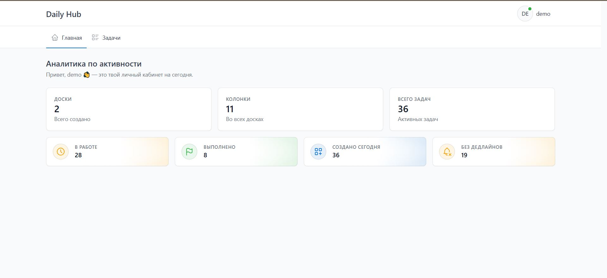
  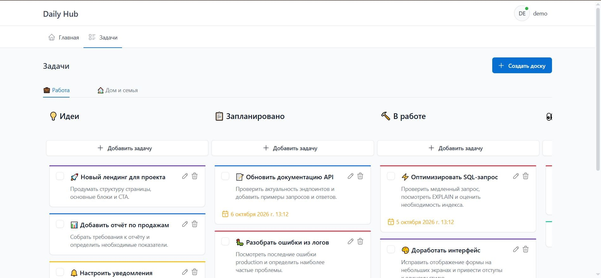
</p>

### 📋 Работа с задачами

<p align="center">
  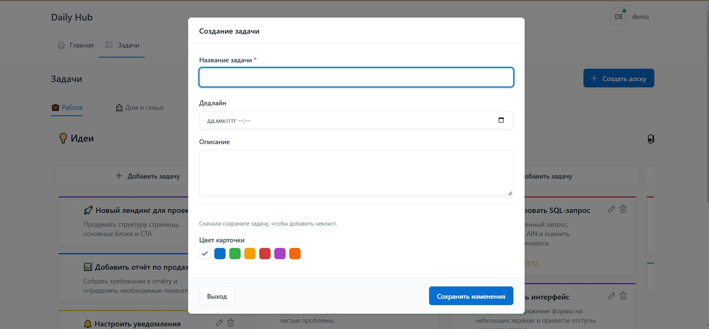
  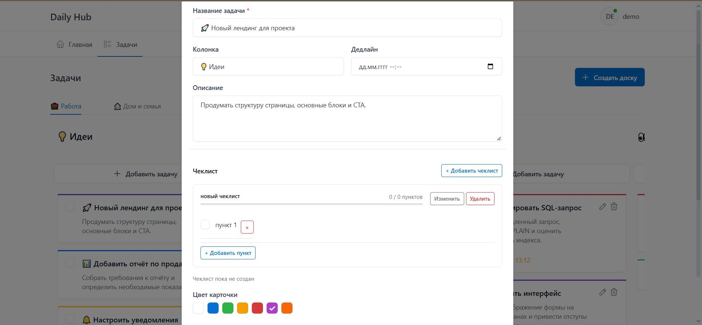
</p>

<p align="center">
  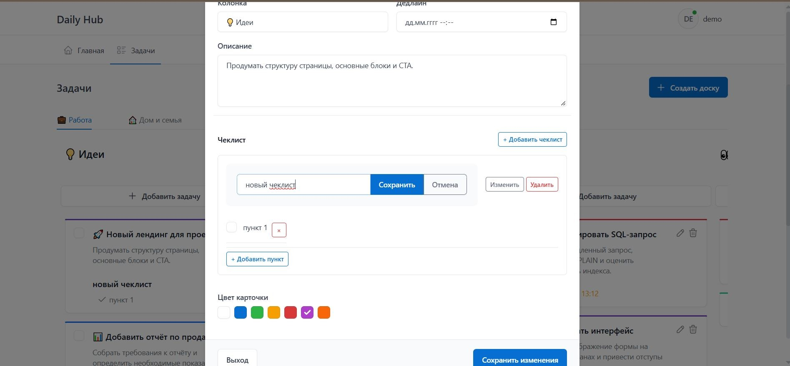
</p>

### 🗂️ Работа с досками и колонками

<p align="center">
  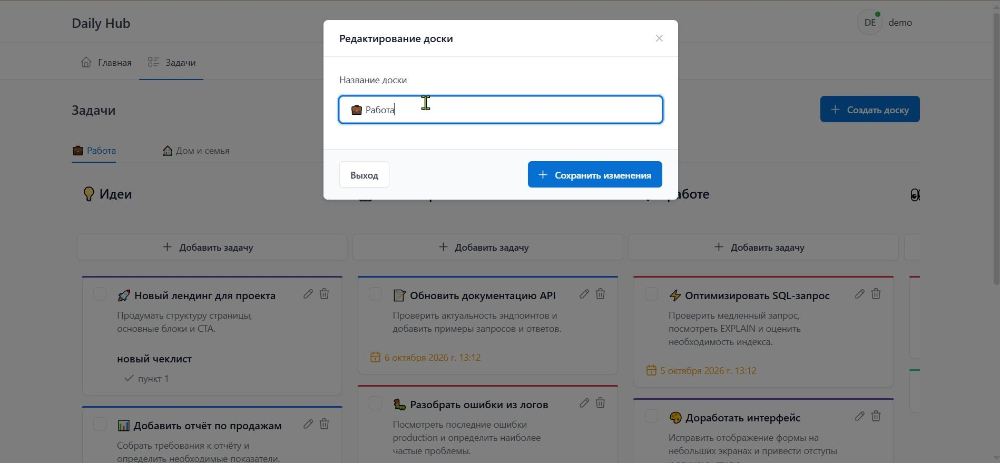
  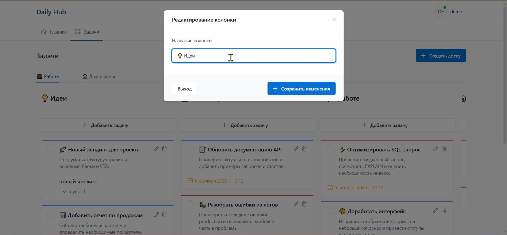
</p>

### 🔐 Аутентификация

<p align="center">
  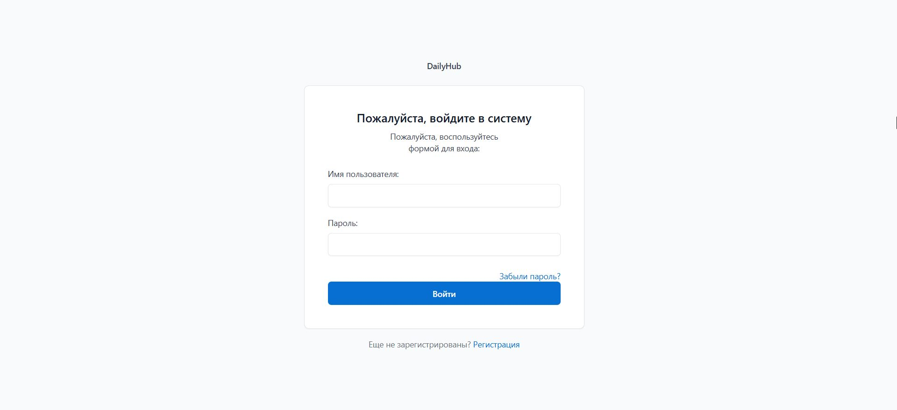
  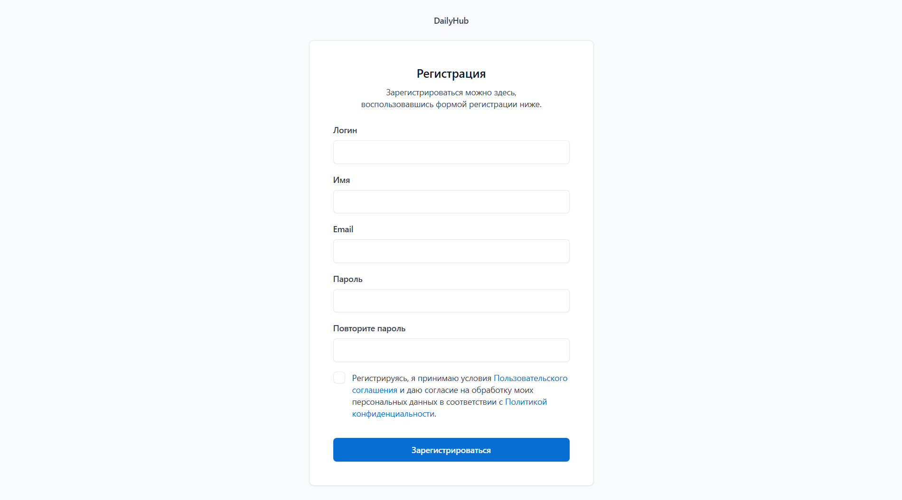
</p>

### 🔑 Восстановление пароля

<p align="center">
  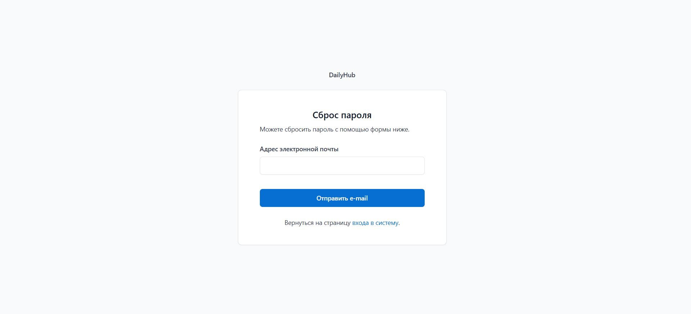
  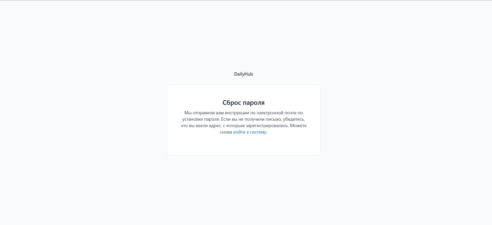
</p>


## 📖 О проекте

Daily Hub — веб-приложение для организации задач по методологии Kanban.

Каждый пользователь может создавать несколько досок, добавлять колонки и задачи, устанавливать сроки выполнения и управлять личным пространством.

Проект создавался как учебный, но постепенно был доведен до уровня production-ready приложения.

---

## Возможности

- регистрация пользователей
- авторизация
- профиль пользователя
- загрузка аватара
- несколько Kanban-досок
- CRUD досок
- CRUD колонок
- CRUD задач
- дедлайны
- цветовые метки
- создание чек-листов и пунктов для них

---

## 🛠️ Используемые технологии

### 🐍 Backend

- **Python 3.12** — основной язык разработки
- **Django 5.2** — веб-фреймворк и бизнес-логика
- **Django ORM** — работа с базой данных
- **Gunicorn** — WSGI-сервер

### 🎨 Frontend

- **HTML5**
- **CSS3**
- **JavaScript**
- **Django Templates** — серверный рендеринг
- **HTMX** — динамическое обновление интерфейса без полноценного SPA

### 🗄️ Хранение данных

- **PostgreSQL** — основная база данных
- **Redis** — брокер/хранилище для фоновых задач и кеширования

### ⚙️ Фоновые задачи

- **Celery** — выполнение фоновых и отложенных задач
- **RabbitMQ** — брокер сообщений

### 🐳 Infrastructure & DevOps

- **Docker** — контейнеризация приложения
- **Docker Compose** — оркестрация сервисов
- **Nginx** — reverse proxy и раздача статических файлов
- **Linux** — production-окружение
- **Git** — контроль версий


### 📦 Дополнительные инструменты

- **OpenAPI / Swagger** — документация REST API

---

## Архитектура

                        🌐 Browser
                              │
                              ▼
                         ┌─────────┐
                         │  Nginx   │
                         └────┬────┘
                              │
                              ▼
                         ┌─────────┐
                         │ Gunicorn │
                         └────┬────┘
                              │
                              ▼
                    ┌─────────────────┐
                    │     Django        │
                    │   Web / API       │
                    └───────┬─────────┘
                            │
              ┌─────────────┼─────────────┐
              │             │             │
              ▼             ▼             ▼
       ┌────────────┐ ┌────────────┐ ┌────────────┐
       │ PostgreSQL  │ │   Redis     │ │  RabbitMQ   │
       │  Database   │ │   Cache     │ │   Broker    │
       └────────────┘ └──────┬─────┘ └──────┬─────┘
                               │               │
                               └──────┬───────┘
                                       ▼
                                ┌─────────────┐
                                │    Celery    │
                                │   Workers    │
                                └─────────────┘

---

## 📁 Структура проекта

```text
daily-hub/
│
├── applications/       # 🧩 Django-приложения и бизнес-логика
│   ├── account/        # Аутентификация и управление пользователями
│   └── tasks/          # Доски, колонки, задачи и чек-листы
│
├── config/             # ⚙️ Конфигурация Django-проекта
│   ├── settings/       # Настройки окружения
│   ├── urls.py         # Маршрутизация
│   ├── celery.py       # Конфигурация Celery
│   └── wsgi.py         # WSGI-конфигурация
│
├── templates/          # 🎨 HTML-шаблоны
│
├── static/             # 🎨 Статические файлы
│   ├── css/
│   ├── js/
│   └── images/
│
├── media/              # 📎 Загружаемые пользователем файлы
│
├── nginx/              # 🌐 Конфигурация Nginx
│
├── scripts/             # 🛠️ Скрипты для запуска и обслуживания проекта
│
├── screenshots/        # 📸 Скриншоты интерфейса
│
├── docker-compose.yml  # 🐳 Конфигурация Docker-сервисов
├── Dockerfile          # 📦 Образ приложения
├── manage.py            # 🧰 Django CLI
└── README.md            # 📖 Документация проекта
```

Проект разделён на отдельные Django-приложения (/applications) и 
конфигурационный слой (config). 
Инфраструктурные компоненты (Nginx, Docker, Celery, RabbitMQ, Redis) 
вынесены отдельно от бизнес-логики приложения.


---

## Локальный запуск

```bash
git clone ...

docker compose up --build
```

---

## Запуск в производственной среде

```bash
docker compose -f docker-compose.prod.yml up -d
```

---

## Переменные окружения

```
DEBUG=False
SECRET_KEY=...
DB_NAME=dailyhub
DB_USER=postgres
DB_PASSWORD=...
DB_HOST=postgres
DB_PORT=5432
```

---

## Автор

Алла Вараксина
